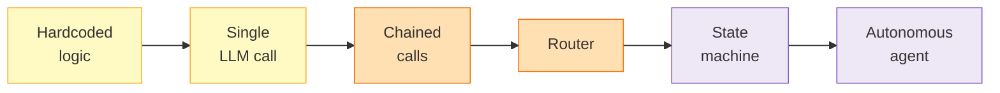
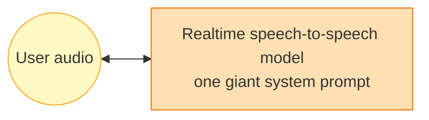
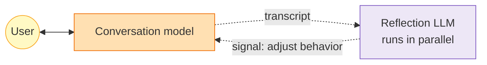
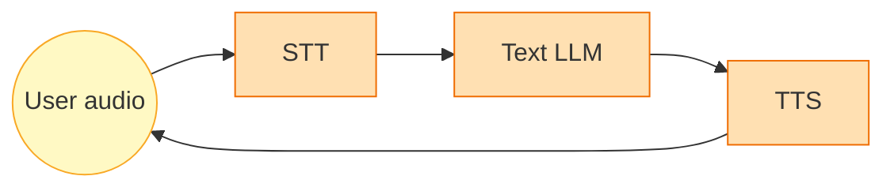
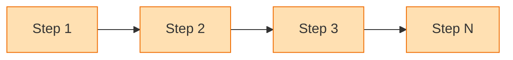
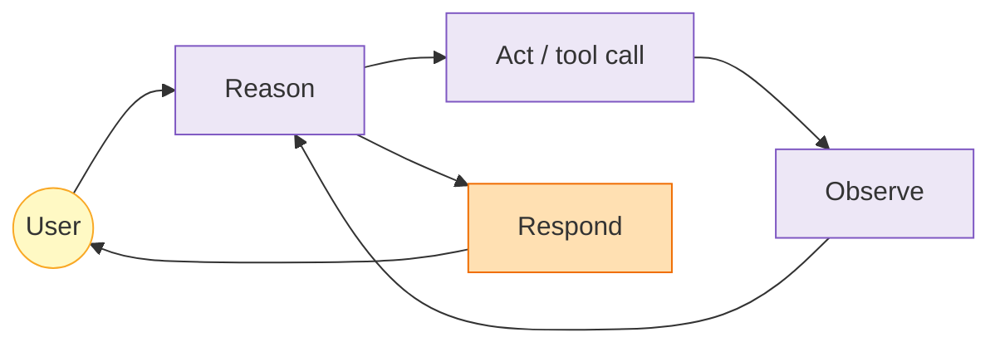
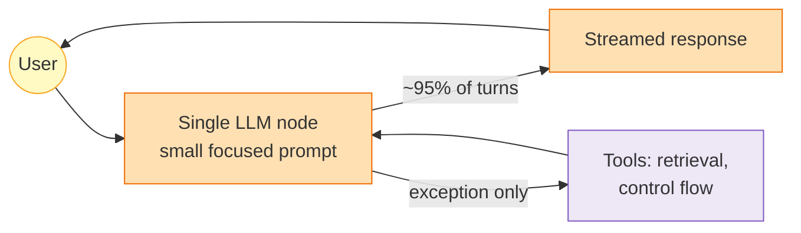
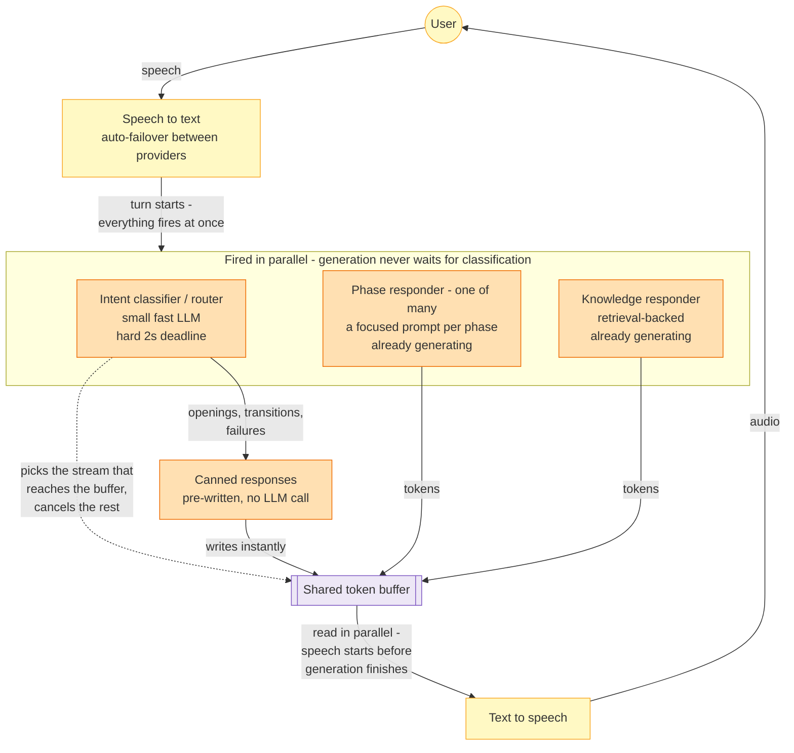

*Voice agents are easy to demo and hard to scale. After nine architectures and a million real conversations, we landed on one that keeps an agent natural, fast, and predictable: fire every possible response in parallel, let a fast router pick the winner. Here's the journey, and why this design works.*

---

## The problem nobody's demo solves

Every voice agent demo looks the same: clean audio, a cooperative user, a short scripted exchange. Then you ship it, and two things break immediately.

**First, latency.** In text chat, a 3-second pause is a spinner. In voice, it's a dead line. Humans feel awkward at ~500ms of silence and assume failure at ~2s. Your budget for everything - speech recognition, deciding what to say, generating it, synthesizing audio - is under a second. Most off-the-shelf agent stacks are built for correctness, not for a hard real-time deadline. They spend your entire budget thinking.

**Second, control.** The obvious fix for latency is a speech-to-speech model with one big prompt. It's fast, and it's a slot machine - no control over what gets said, when, or how. The obvious fix for control is a workflow engine with explicit steps. It's predictable, and it talks like an IVR menu.

Real-time conversation agents live between those two failure modes. And here's the premise of this post: you can't understand why the final architecture looks the way it does without first seeing what didn't work. So before we get to Speculative Routing, we'll walk through everything we tried, in order.

## The autonomy spectrum

A useful frame (from LangChain's writing on [cognitive architectures](https://blog.langchain.dev/what-is-a-cognitive-architecture/)) is a spectrum from hardcoded logic to full autonomy:

Moving right gives you flexibility and costs predictability. What that framing misses, and what voice makes obvious fast: moving right also costs **latency**. Every extra LLM decision on the hot path is 300-800ms of silence. The whole game is deciding which decisions belong on the hot path at all.

We walked nearly this entire spectrum, in both directions. Here's the journey.

---

## Act I: The single-prompt era

### 1. Speech-to-speech with one mega-prompt

The fastest possible architecture: a realtime speech-to-speech API, one system prompt with runtime substitutions, done. Out-of-the-box VAD, STT, TTS, genuinely low latency.

It fell apart on quality. Transcription was poor. Background noise got interpreted as speech and answered. Hallucinations were frequent. The audio was robotic with no control over tone. And the model happily ignored half the instructions in the prompt.

> **Learning:** speech-to-speech gives you speed by taking away all your control. When quality breaks - and it will - there's no knob to turn.

### 2. Adding a reflection loop

Next we bolted on **reflection**: an independent LLM evaluating the conversation in parallel, injecting adjustments into the system prompt when it detected problems (adversarial users, time pressure).

It worked, sort of. It caught bad actors and could speed the conversation up. But by the time reflection finished, the conversation had moved on. A stale signal steering a live conversation is worse than no signal.

> **Learning:** parallel evaluation is valuable, but its output must land at a turn boundary, not mid-flight. Also: prompt instructions alone will never be a security boundary.

### 3. Going text-first (cascaded pipeline)

We swapped speech-to-speech for a cascaded pipeline: dedicated STT, text LLM, dedicated TTS. Transcription quality jumped. Audio became realistic and controllable. Responses and interruption handling improved a lot.

The cost: more transformations, more latency. But the latency is manageable **if every hop lives on the same infrastructure**. The killer isn't model inference - it's server hops.

> **Learning:** text-to-text quality beats speech-to-speech by a wide margin, and the latency penalty is an infrastructure problem, not a model problem. Co-locate the pipeline.

### 4. Prompt-state swapping (focused tokens)

We tried inferring conversation state and hot-swapping sections of the system prompt in and out, so the model only sees instructions relevant to the current topic. Keep the prompt small and focused.

The intuition was right, the execution wasn't. Context switching was clunky and interruption handling degraded. But it taught us the most useful prompt lesson of the whole journey:

> **Learning:** an overloaded prompt *will* hallucinate or ignore instructions. The bigger the prompt, the worse the instruction-following. Small focused prompts beat comprehensive ones, always.

### 5. Dynamic prompt compilation

Instead of one generic prompt with context stuffed in, we started *generating* a custom prompt per session - compiling the context into explicit instructions before the conversation begins.

Output quality jumped again. The agent felt personalized instead of templated.

> **Learning:** a dynamically compiled prompt beats a generic prompt + raw context. Telling the model *how* to use information is more predictable than handing it information and hoping. But we now needed tooling (retrieval, validations) that a single prompt can't carry.

---

## Act II: The workflow detour

### 6. Workflow engines

We built on an open-source conversation-workflow framework (the Pipecat family). Vendorless, composable, full control over every component.

The conversations came out *transactional*. Every exchange felt like a form field being filled. Workflow graphs are great at "collect X, then Y, then Z" and terrible at open-ended dialogue, because real conversations don't move in a fixed order.

> **Learning:** workflows suit conversations with a clear objective and a logical order (booking, support triage). For open-ended dialogue, the user feels the rigidity. This is why conventional workflow architecture is the wrong default for conversation agents.

### 7. Full ReAct agent

So we swung to the other extreme: a LangGraph agent running the classic ReAct loop - reason, act, observe, repeat - with open-ended tool calling.

Reasoning quality was the best yet. Follow-ups felt natural. And the latency was unacceptable. Open-ended tool calling means unbounded reasoning cycles: a single user utterance could trigger several LLM round-trips before the first response token exists. In text, fine. In voice, that's five seconds of silence.

> **Learning:** reasoning on every turn is a latency non-starter. The ReAct loop's flexibility is exactly what makes its response time unbounded, and voice needs a bound.

---

## Act III: The synthesis

### 8. One fast node, tools as escape hatches

The breakthrough was to demote the LLM, not upgrade it. Instead of an agent that reasons every turn, we ran a **single LLM node with a focused prompt that handles the entire conversation directly** - and tools fire only for exceptions: an off-topic question needing retrieval, a control-flow event, an edge case.

The prompt runs the conversation. The tooling handles the exceptions. On the common path there is exactly one LLM call between the user finishing a sentence and audio streaming back.

> **Learning:** this was the single biggest unlock. **Don't spend reasoning on the happy path.** Let a well-compiled prompt carry ~95% of turns at single-call latency. Reserve multi-step machinery for the turns that need it.

### 9. Specialization: templates + live reflection

One generic prompt has a ceiling. We split it into **specialized templates** per conversation type - each phase of a session can run a different focused prompt with its own structured-output schema - and reintroduced reflection, this time correctly: as a background evaluator whose signals merge into state at turn boundaries.

> **Learning:** specialize prompts per phase, benchmark them like code, and treat prompt templates as versioned artifacts. The new problem becomes template management. That's a much better problem than latency.

---

## The architecture that survived: Speculative Routing

Here's where it landed. We call it **Speculative Routing**: a fully async state machine where every turn fires all possible responses in parallel - speculatively, before the routing decision exists - and a fast router picks the winner mid-flight. It drives a cascaded voice pipeline in production today. It sits at the state-machine point on the autonomy spectrum on purpose - enough structure to be predictable, enough LLM routing to be conversational. Every design decision follows one rule: *nothing blocks the path from user speech to first audio byte*.

The decisions that matter:

**A state machine, not an agent loop.** The graph topology is fixed and known: route the turn, run one specialized node, stream. There is no open-ended reason/act cycle at runtime. It executes as plain async tasks - the graph lives in the design, not as a runtime engine.

**Nothing waits for the router.** Every turn starts by firing everything at once: the intent classifier and the candidate responders all start as parallel tasks, each streaming into its own queue. The classifier is a small fast model at temperature 0, so it finishes first - it picks which responder's stream reaches the token buffer and cancels the rest. Classification runs under a **2-second budget**; if it doesn't answer in time, a deterministic fallback keeps the conversation moving. A routing decision is never allowed to become user-facing silence. Intents accumulate in a chain, so decisions that need confirmation (like ending the session) require two consecutive signals, not one flaky classification.

**Everything streams through queues.** Every LLM call runs as a background task producing into an async token queue; the consumer drains it token-by-token into TTS. First audio reaches the user before the model finishes generating. Structured metadata the model emits *after* the spoken content (evaluation fields, analysis) is captured by a background drain task after speech ends. The user never waits for it.

**The state machine looks like an LLM.** A thin adapter exposes the whole machine as a standard streaming-LLM interface to the media framework. Inbound, it translates chat context (including interruption flags for barge-in rollback). Outbound, it emits token chunks and filters control tool-calls out of the speech stream. The media layer doesn't know there's a graph behind the interface, which means the two evolve independently.

**Failure paths are pre-computed.** Every node has static, pre-localized fallback messages - zero generation on the failure path. Primary model failure triggers an inline fallback model. STT and TTS run behind primary/fallback adapters that fail over without dropping the turn. A false barge-in (noise cancels the agent mid-sentence) is detected and speech resumes without repeating.

**Crash recovery is built in, not an ops runbook.** Conversation state is snapshotted per turn (keyed by a hash of recent messages) and periodically persisted. If the process dies mid-conversation, a replacement loads the full state and continues where it left off. At scale, processes *will* die mid-conversation. The architecture has to assume it.

**Reflection finally works - off the hot path.** Background evaluators observe the conversation continuously, and their results merge into state at turn boundaries. The same idea as architecture #2, done right this time.

## The principles, distilled

Nine architectures boil down to five rules:

1. **Latency is the architecture.** Count the LLM calls between end-of-speech and first audio byte. The answer must be one. Everything else is scheduling.
2. **Don't reason on the happy path.** A focused, dynamically compiled prompt handles the overwhelming majority of turns. Reserve multi-step machinery for exceptions.
3. **Small prompts follow instructions; big prompts hallucinate.** Specialize per phase instead of writing one prompt that knows everything.
4. **Everything slow goes to the background** - evaluation, metadata capture, persistence - and merges back at turn boundaries, never mid-flight.
5. **Design the failure paths first.** Static fallback messages, provider failover, time-budgeted decisions, turn-keyed recovery. In real-time voice, graceful degradation *is* the product.

The spectrum makes it look like more autonomy means more capability. For real-time conversation, that's not true. What works is simpler and harder to build: a state machine with a fixed topology, responses racing in parallel, pre-computed failure paths - and LLM reasoning only on the turns that need it. That's Speculative Routing.

---

*These learnings come from leading the team building an AI interviewer scaled for a million interviews. Full credit to the team at Eightfold - engineers who built, tested, and rebuilt nine architectures, learning and evolving at every step without losing momentum. None of the iterations were wasted - each one taught us a lesson that made it into this post. And this is just one of the hundreds of problems we've solved to get there.*
